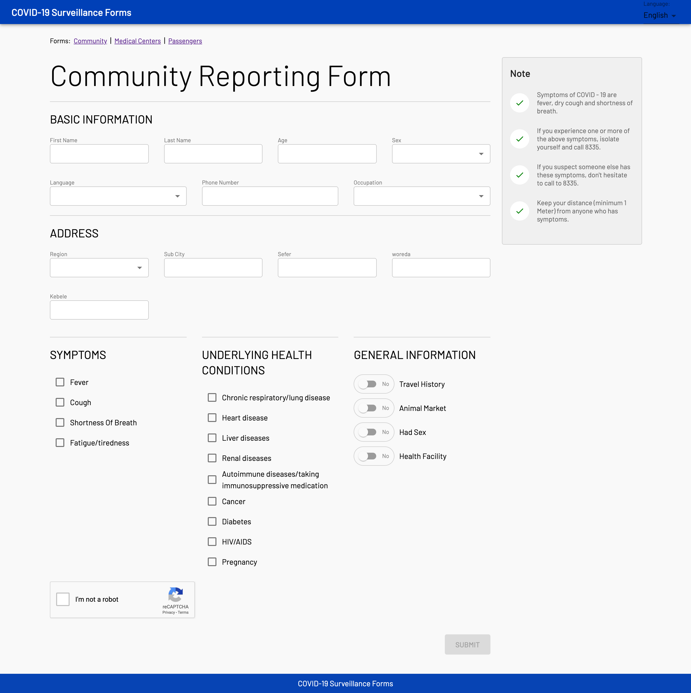
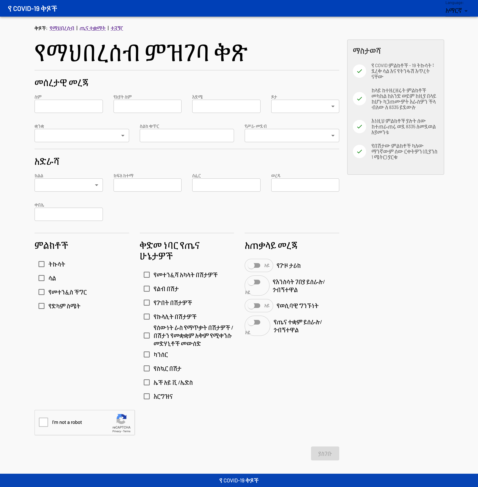
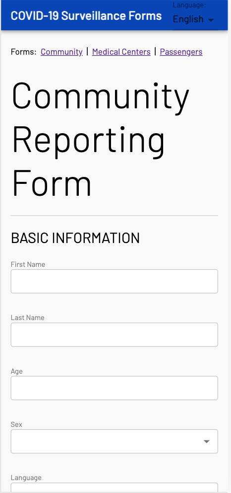
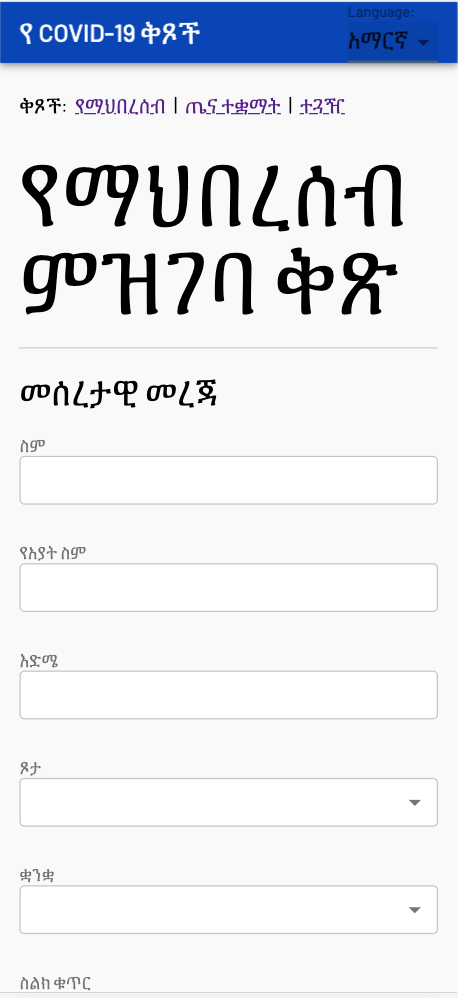

# COVID19 - Surveillance Forms

Available Forms:
* Community Reporting Form
* Medical Centers Form
* Passengers / Port-of-Entry Form

Community Form            |  Community i18n
:-------------------------:|:-------------------------:
  |  
 | 

Overview:
* Mobile first
* Internationalization Support
* Common Form Utilities
* Environment Configuration

## Development

### Local Setup

```
# first time - install all dependencies
$ yarn install

# start the server
$ yarn local
```

### Component Development

Use storybook to develop components in isolation (see `*.story.js` files under `src/components`).

```
# start storybook
$ yarn storybook
```

### API Integration

- API calls live at the bottom of `src/api/index.js`
- Clone [API Gateway repo](https://github.com/Ethiopia-COVID19/api-gateway) and follow directions to start the API locally.

### State Management

- State is managed using [mobx](https://github.com/mobxjs/mobx) library (see `src/modules/resource/LanguageStore.js`).
- See `src/controllers/Community.js` for usage.

### Containers (Pages)
- Represents a page in the application
- Mapped to a route - see `App.js`
- Have access to `react-router-dom` properties `match`, `history` and `location`

## Guides

### How to add a form

- Create the form component under `src/components` (see `src/components/CommunityForm.js`)
- Create a page under `src/containers` (see `src/containers/Community.js`)
- Map your page to a route in `src/core/App.js`

### How to add a new language
- Add a new language pack by duplicating `src/modules/lang/phrases_en.js`
- Import and map new language in `src/modules/lang/lang-util.js`

### How to setup a localized date field

- To add support for more languages for calendar, we use [moment.js](https://momentjs.com/docs/#/i18n/)
- For languages `moment.js` does not support, one can add support using `moment.defineLocale()`. See the example in `src/modules/lang/moment-lang.js`, where Amharic support was added.

### How to Setup Google Recaptcha

TODO
